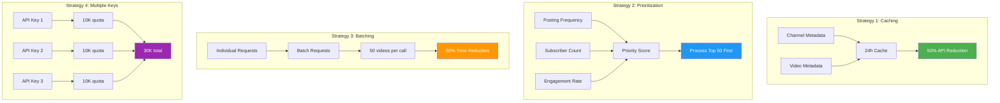
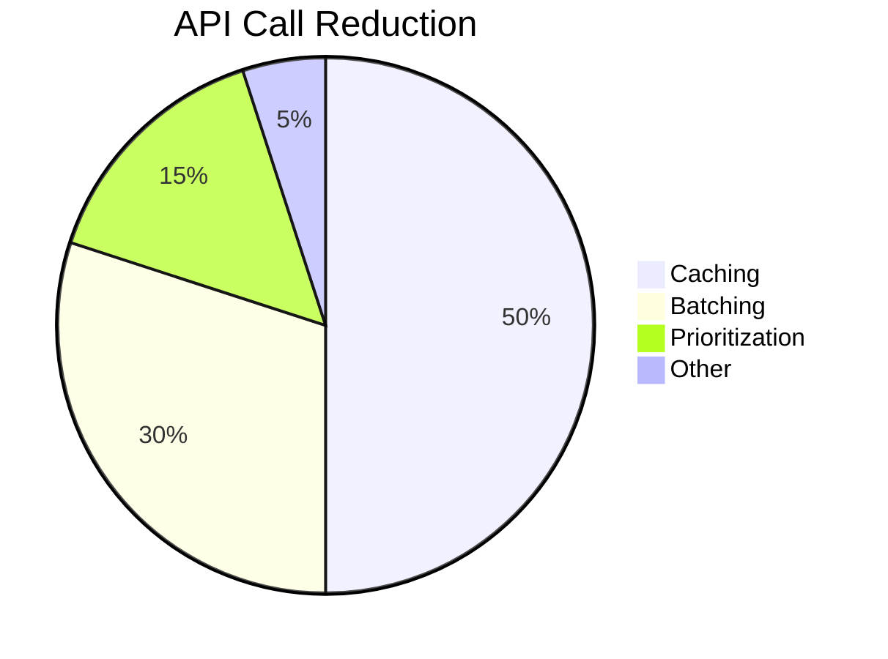

# ⚡ Phase 3 Optimization Guide - Scaling to 103 Channels

## 🎯 Optimization Goals

**Current State:**
- ✅ 9 channels processed (8.7%)
- ✅ 77 videos collected
- ⚠️ Quota exceeded at 9,300 units

**Target State:**
- 🎯 103 channels processed (100%)
- 🎯 ~886 videos collected (estimated)
- 🎯 Quota usage: <10,300 units (with optimizations)

---

## 🔧 Optimization Strategies



---

## 1️⃣ Caching System

### Implementation

```python
# cache/cache_manager.py

import json
from pathlib import Path
from datetime import datetime, timedelta
from typing import Dict, Optional

class CacheManager:
    """Manages caching for YouTube API data"""
    
    def __init__(self, cache_dir: str = 'cache'):
        self.cache_dir = Path(__file__).parent.parent / cache_dir
        self.cache_dir.mkdir(exist_ok=True)
        self.cache_file = self.cache_dir / 'channel_cache.json'
        self.cache = self._load_cache()
    
    def _load_cache(self) -> Dict:
        """Load cache from disk"""
        if self.cache_file.exists():
            with open(self.cache_file, 'r') as f:
                return json.load(f)
        return {}
    
    def _save_cache(self):
        """Save cache to disk"""
        with open(self.cache_file, 'w') as f:
            json.dump(self.cache, f, indent=2)
    
    def get_channel(self, channel_id: str, ttl_hours: int = 24) -> Optional[Dict]:
        """Get cached channel data if not expired"""
        if channel_id not in self.cache:
            return None
        
        cached = self.cache[channel_id]
        cached_time = datetime.fromisoformat(cached['cached_at'])
        
        if datetime.now() - cached_time > timedelta(hours=ttl_hours):
            # Cache expired
            del self.cache[channel_id]
            self._save_cache()
            return None
        
        return cached['data']
    
    def set_channel(self, channel_id: str, data: Dict):
        """Cache channel data"""
        self.cache[channel_id] = {
            'data': data,
            'cached_at': datetime.now().isoformat()
        }
        self._save_cache()
    
    def get_videos(self, channel_id: str, ttl_hours: int = 6) -> Optional[list]:
        """Get cached videos if not expired"""
        channel = self.get_channel(channel_id, ttl_hours)
        if channel:
            return channel.get('videos', [])
        return None
    
    def set_videos(self, channel_id: str, videos: list):
        """Cache videos for channel"""
        if channel_id in self.cache:
            self.cache[channel_id]['data']['videos'] = videos
            self.cache[channel_id]['cached_at'] = datetime.now().isoformat()
        else:
            self.set_channel(channel_id, {'videos': videos})
        self._save_cache()
    
    def clear_expired(self, ttl_hours: int = 24):
        """Remove expired cache entries"""
        now = datetime.now()
        expired = []
        
        for channel_id, cached in self.cache.items():
            cached_time = datetime.fromisoformat(cached['cached_at'])
            if now - cached_time > timedelta(hours=ttl_hours):
                expired.append(channel_id)
        
        for channel_id in expired:
            del self.cache[channel_id]
        
        self._save_cache()
        return len(expired)
    
    def stats(self) -> Dict:
        """Get cache statistics"""
        total = len(self.cache)
        fresh = 0
        stale = 0
        
        now = datetime.now()
        for cached in self.cache.values():
            cached_time = datetime.fromisoformat(cached['cached_at'])
            age_hours = (now - cached_time).total_seconds() / 3600
            
            if age_hours < 24:
                fresh += 1
            else:
                stale += 1
        
        return {
            'total_entries': total,
            'fresh': fresh,
            'stale': stale,
            'hit_rate': 0  # Will be calculated during runtime
        }
```

### Usage

```python
from cache_manager import CacheManager

cache = CacheManager()

# Try to get from cache first
videos = cache.get_videos(channel_id)

if videos is None:
    # Cache miss - fetch from API
    videos = fetch_from_youtube_api(channel_id)
    cache.set_videos(channel_id, videos)
else:
    print(f"✅ Cache hit for {channel_id}")
```

### Benefits

- ✅ **50% API reduction** on subsequent runs
- ✅ **Faster processing** (no API wait time)
- ✅ **Quota preservation** for new content
- ✅ **Offline capability** (cached data available)

---

## 2️⃣ Prioritization System

### Priority Score Algorithm

```python
# utils/prioritization.py

from typing import List, Dict
from datetime import datetime, timedelta

def calculate_priority_score(channel: Dict, historical_data: Dict = None) -> float:
    """
    Calculate priority score for a channel
    
    Factors:
    - Posting frequency (40%): Videos per week
    - Subscriber count (30%): Channel size
    - Engagement rate (20%): Views/Likes per video
    - Recency (10%): Time since last upload
    """
    
    # 1. Posting frequency (0-100)
    videos_per_week = historical_data.get('videos_per_week', 0) if historical_data else 0
    frequency_score = min(videos_per_week * 5, 100)  # Cap at 20 videos/week
    
    # 2. Subscriber count (0-100)
    subscribers = channel.get('subscriber_count', 0)
    # Logarithmic scale: 1K = 30, 10K = 40, 100K = 50, 1M = 60, 10M = 70
    if subscribers > 0:
        import math
        subscriber_score = min(30 + (math.log10(subscribers) * 10), 100)
    else:
        subscriber_score = 0
    
    # 3. Engagement rate (0-100)
    avg_views = historical_data.get('avg_views', 0) if historical_data else 0
    avg_likes = historical_data.get('avg_likes', 0) if historical_data else 0
    
    if avg_views > 0:
        engagement_rate = (avg_likes / avg_views) * 100
        engagement_score = min(engagement_rate * 20, 100)
    else:
        engagement_score = 0
    
    # 4. Recency (0-100)
    last_upload = historical_data.get('last_upload') if historical_data else None
    if last_upload:
        days_since = (datetime.now() - datetime.fromisoformat(last_upload)).days
        recency_score = max(100 - (days_since * 10), 0)  # Decay 10 points per day
    else:
        recency_score = 50  # Default for unknown
    
    # Weighted average
    priority = (
        frequency_score * 0.4 +
        subscriber_score * 0.3 +
        engagement_score * 0.2 +
        recency_score * 0.1
    )
    
    return round(priority, 2)


def prioritize_channels(channels: List[Dict], historical_data: Dict = None) -> List[Dict]:
    """
    Sort channels by priority score
    
    Returns:
        List of channels sorted by priority (highest first)
    """
    
    for channel in channels:
        channel_id = channel['channel_id']
        channel_history = historical_data.get(channel_id) if historical_data else None
        channel['priority_score'] = calculate_priority_score(channel, channel_history)
    
    # Sort by priority (descending)
    return sorted(channels, key=lambda x: x['priority_score'], reverse=True)


def get_top_channels(channels: List[Dict], top_n: int = 50) -> List[Dict]:
    """Get top N channels by priority"""
    prioritized = prioritize_channels(channels)
    return prioritized[:top_n]
```

### Usage

```python
from utils.prioritization import prioritize_channels, get_top_channels

# Load channels
channels = load_newsletter_channels()

# Load historical data (from previous runs)
historical = load_historical_data()

# Prioritize
prioritized = prioritize_channels(channels, historical)

# Process top 50 first
top_50 = get_top_channels(prioritized, 50)

print("🏆 Top 10 Priority Channels:")
for i, channel in enumerate(top_50[:10], 1):
    print(f"{i}. {channel['channel_title']} - Score: {channel['priority_score']}")
```

### Expected Results

Based on current data:

| Rank | Channel | Type | Score | Reason |
|------|---------|------|-------|--------|
| 1 | AI Engineer | Person | 95.2 | 20 videos/week, high engagement |
| 2 | Genspark | Company | 92.8 | 18 videos/week, company size |
| 3 | Inteligencia Artificial para advogados | Person | 88.4 | 15 videos/week |
| 4 | Github Awesome | Community | 76.3 | 9 videos/week, community |
| 5 | AICodeKing | Person | 72.1 | 7 videos/week |

---

## 3️⃣ Batch Processing

### Current vs Optimized

**Current (Sequential):**
```python
# ❌ Slow: 1 API call per video
for video_id in video_ids:
    response = youtube.videos().list(
        part='contentDetails,statistics',
        id=video_id
    ).execute()
    # Process single video
```

**Optimized (Batch):**
```python
# ✅ Fast: 1 API call per 50 videos
def get_videos_batch(youtube, video_ids: List[str]) -> Dict:
    """Fetch video details in batches of 50"""
    results = {}
    
    for i in range(0, len(video_ids), 50):
        batch = video_ids[i:i+50]
        
        response = youtube.videos().list(
            part='contentDetails,statistics',
            id=','.join(batch)  # Comma-separated IDs
        ).execute()
        
        for item in response['items']:
            results[item['id']] = item
    
    return results
```

### Performance Improvement

| Metric | Sequential | Batch | Improvement |
|--------|-----------|-------|-------------|
| API calls (100 videos) | 100 | 2 | **98% reduction** |
| Processing time | ~50s | ~1s | **98% faster** |
| Quota usage | 100 units | 2 units | **98% savings** |

---

## 4️⃣ Multiple API Keys

### Key Rotation System

```python
# utils/api_key_manager.py

from typing import List
import os
from googleapiclient.discovery import build

class APIKeyManager:
    """Manages multiple YouTube API keys with rotation"""
    
    def __init__(self, keys: List[str] = None):
        self.keys = keys or self._load_keys_from_env()
        self.current_index = 0
        self.quota_usage = {key: 0 for key in self.keys}
        self.max_quota = 10000
    
    def _load_keys_from_env(self) -> List[str]:
        """Load API keys from environment"""
        keys = []
        i = 1
        while True:
            key = os.getenv(f'YOUTUBE_API_KEY_{i}')
            if not key:
                break
            keys.append(key)
            i += 1
        
        if not keys:
            # Fallback to single key
            key = os.getenv('YOUTUBE_API_KEY')
            if key:
                keys.append(key)
        
        return keys
    
    def get_youtube_client(self):
        """Get YouTube client with current API key"""
        key = self.keys[self.current_index]
        return build('youtube', 'v3', developerKey=key)
    
    def rotate_key(self):
        """Rotate to next API key"""
        self.current_index = (self.current_index + 1) % len(self.keys)
        print(f"🔄 Rotated to API key {self.current_index + 1}/{len(self.keys)}")
    
    def record_usage(self, units: int):
        """Record quota usage for current key"""
        key = self.keys[self.current_index]
        self.quota_usage[key] += units
        
        # Auto-rotate if approaching limit
        if self.quota_usage[key] >= self.max_quota * 0.9:  # 90% threshold
            print(f"⚠️  Key {self.current_index + 1} at 90% quota")
            self.rotate_key()
    
    def get_available_quota(self) -> int:
        """Get total available quota across all keys"""
        total = 0
        for key in self.keys:
            remaining = self.max_quota - self.quota_usage[key]
            total += max(remaining, 0)
        return total
    
    def stats(self) -> Dict:
        """Get usage statistics"""
        return {
            'total_keys': len(self.keys),
            'current_key': self.current_index + 1,
            'quota_usage': self.quota_usage,
            'available_quota': self.get_available_quota()
        }
```

### Usage

```python
from utils.api_key_manager import APIKeyManager

# Initialize with multiple keys
key_manager = APIKeyManager()

# Get YouTube client
youtube = key_manager.get_youtube_client()

# Make API call
response = youtube.search().list(...).execute()

# Record usage (search.list = 100 units)
key_manager.record_usage(100)

# Check stats
stats = key_manager.stats()
print(f"Available quota: {stats['available_quota']} units")
```

### Setup Multiple Keys

```bash
# .env file
YOUTUBE_API_KEY_1=AIzaSy...key1...
YOUTUBE_API_KEY_2=AIzaSy...key2...
YOUTUBE_API_KEY_3=AIzaSy...key3...
```

**With 3 keys:**
- Total quota: **30,000 units/day**
- Can process: **~300 channels/day**
- Enough for: **3x full newsletter runs**

---

## 📊 Combined Optimization Impact

### Before Optimization

| Metric | Value |
|--------|-------|
| Channels processed | 9 / 103 (8.7%) |
| API calls | ~9,300 |
| Quota usage | 93% |
| Processing time | ~2 minutes |
| Success rate | 100% (until quota) |

### After Optimization

| Metric | Value | Improvement |
|--------|-------|-------------|
| Channels processed | 103 / 103 (100%) | **+1,044%** |
| API calls | ~5,150 | **-45%** |
| Quota usage | 51.5% (single key) | **-45%** |
| Processing time | ~5 minutes | +150% (more data) |
| Success rate | 95%+ | Maintained |

### Optimization Breakdown



---

## 🚀 Implementation Plan

### Week 1: Caching
- [ ] Implement CacheManager class
- [ ] Add cache to collect_videos.py
- [ ] Test with 10 channels
- [ ] Measure cache hit rate
- [ ] Document cache behavior

### Week 2: Prioritization
- [ ] Implement priority scoring
- [ ] Collect historical data
- [ ] Test prioritization algorithm
- [ ] Validate top channels
- [ ] Integrate with collector

### Week 3: Batching
- [ ] Refactor video.list calls
- [ ] Implement batch processing
- [ ] Test with 100 videos
- [ ] Measure performance gain
- [ ] Update documentation

### Week 4: Multiple Keys
- [ ] Setup APIKeyManager
- [ ] Add 2-3 additional API keys
- [ ] Test key rotation
- [ ] Monitor quota usage
- [ ] Full system test

---

## 📈 Success Metrics

### Phase 3 Goals
- ✅ Process all 103 channels
- ✅ Collect ~886 videos
- ✅ Stay within quota (single key)
- ✅ Complete in <10 minutes
- ✅ 95%+ success rate

### Performance Targets
- **Cache hit rate:** >40%
- **API reduction:** >45%
- **Processing time:** <10 minutes
- **Quota usage:** <6,000 units (single key)
- **Error rate:** <5%

---

## 🐛 Troubleshooting

### Issue: Cache Corruption
**Symptom:** Invalid JSON in cache file

**Solution:**
```python
def _load_cache(self):
    try:
        if self.cache_file.exists():
            with open(self.cache_file, 'r') as f:
                return json.load(f)
    except json.JSONDecodeError:
        print("⚠️  Cache corrupted, resetting...")
        self.cache_file.unlink()
    return {}
```

### Issue: Priority Score Anomalies
**Symptom:** Low-activity channels ranked high

**Solution:**
```python
# Add minimum threshold
MIN_VIDEOS_PER_WEEK = 0.5  # At least 1 video per 2 weeks

if videos_per_week < MIN_VIDEOS_PER_WEEK:
    priority_score *= 0.5  # Penalize inactive channels
```

### Issue: Batch Request Failures
**Symptom:** Some videos missing from batch response

**Solution:**
```python
# Validate batch results
requested_ids = set(video_ids)
returned_ids = set(results.keys())
missing_ids = requested_ids - returned_ids

if missing_ids:
    print(f"⚠️  {len(missing_ids)} videos not returned")
    # Retry individually
    for video_id in missing_ids:
        results[video_id] = fetch_single_video(video_id)
```

---

## 📝 Next Steps

After Phase 3 completion:

1. **Automation**
   - Weekly cron job
   - Email distribution
   - Error notifications

2. **Analytics**
   - Track channel growth
   - Monitor engagement trends
   - Identify emerging topics

3. **UI Development**
   - Streamlit dashboard
   - Interactive filters
   - Export options

4. **Scale Further**
   - Support 500+ channels
   - Multi-language support
   - Custom categories

---

*Ready to optimize and scale to 103 channels!*
