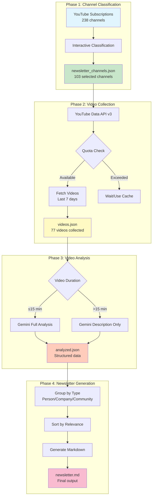
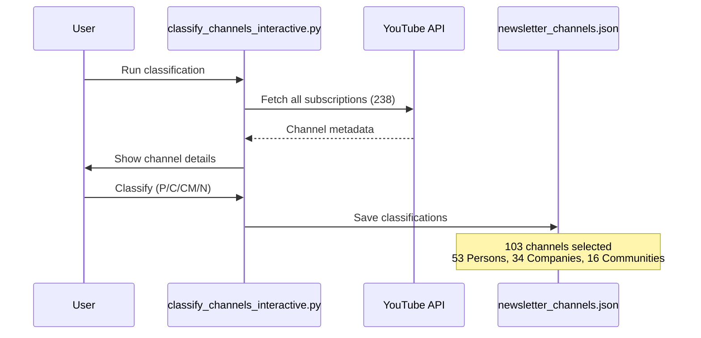
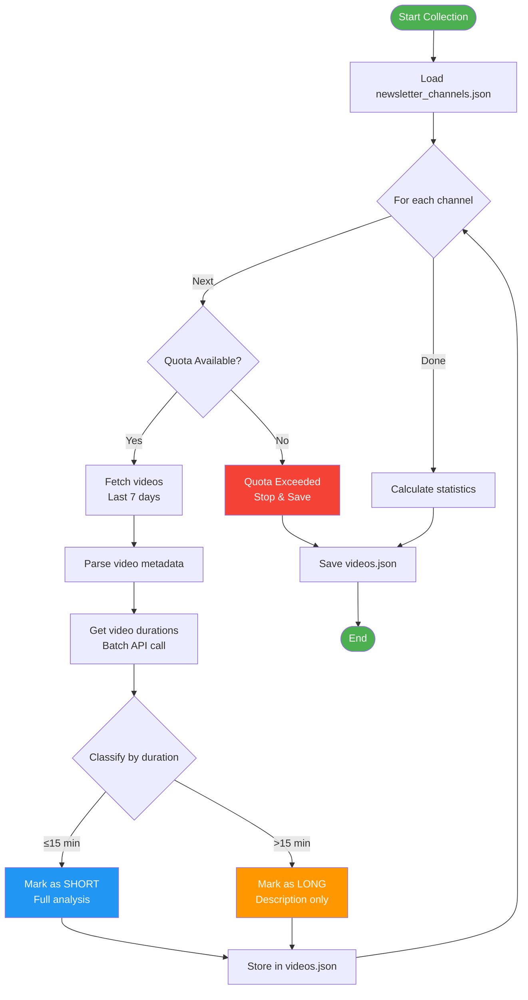
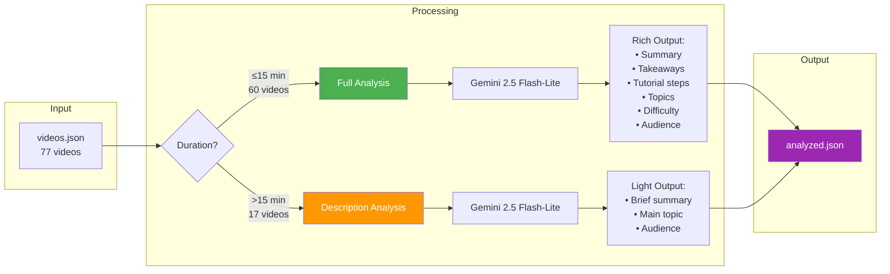
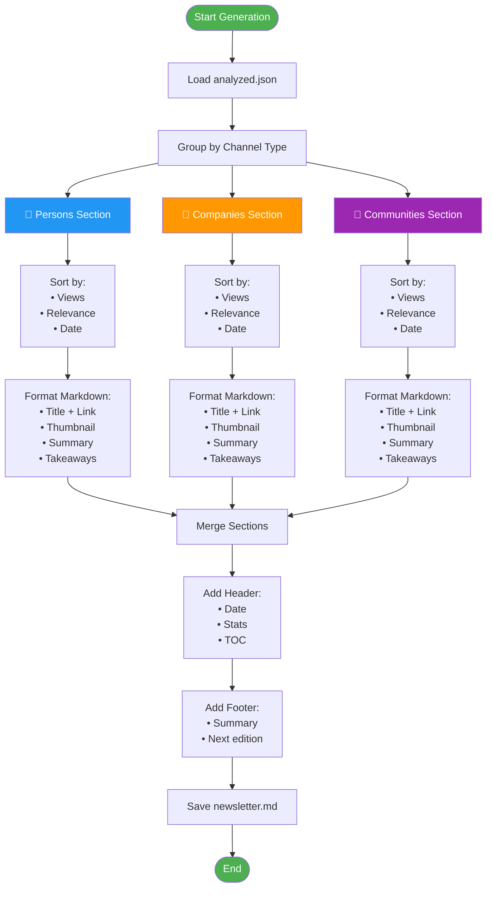
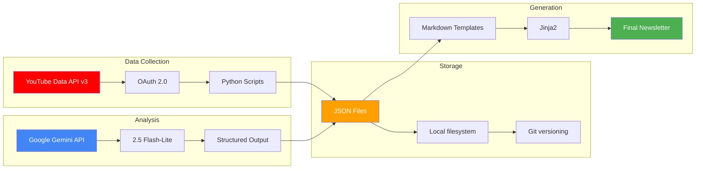
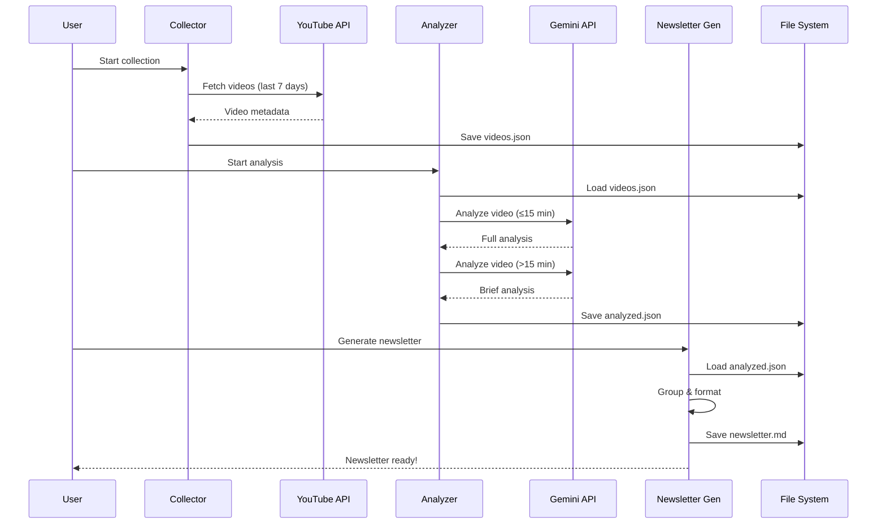

# 🏗️ AI Newsletter Pipeline Architecture

## 📊 System Overview



---

## 🔄 Detailed Workflow

### 1️⃣ Channel Classification Pipeline



**Input:**
- `all_subscriptions.json` (238 channels)
- User interactive input

**Output:**
- `newsletter_channels.json` (103 channels)
- Classification: Person, Company, Community

**Stats:**
- 👤 53 Persons (51.5%)
- 🏢 34 Companies (33.0%)
- 👥 16 Communities (15.5%)

---

### 2️⃣ Video Collection Pipeline



**API Quota Management:**
```
YouTube Data API v3 Costs:
- search.list: 100 units
- videos.list: 1 unit
- Daily quota: 10,000 units

Max channels per day: ~100 channels
(100 units × 100 channels = 10,000 units)
```

**Current Results:**
- ✅ 9 channels processed
- ✅ 77 videos collected
- ⚠️ Quota exceeded at channel #93

---

### 3️⃣ Video Analysis Pipeline



**Gemini API Configuration:**
```python
model = "gemini-2.5-flash-lite"
config = {
    "temperature": 0.7,
    "max_output_tokens": 2048,
    "top_p": 0.95,
    "top_k": 40
}
```

**Cost Breakdown (77 videos):**
| Type | Count | Cost/Video | Total |
|------|-------|------------|-------|
| Short (≤15 min) | 60 | $0.01 | $0.60 |
| Long (>15 min) | 17 | $0.001 | $0.017 |
| Newsletter Gen | 1 | $0.0075 | $0.0075 |
| **TOTAL** | **77** | - | **$0.625** |

---

### 4️⃣ Newsletter Generation Pipeline



**Newsletter Structure:**
```markdown
# 🤖 AI Newsletter - Week of Nov 27, 2025

## 📊 This Week's Stats
- 📺 77 videos from 9 channels
- ⏰ 26.5 hours of content
- 🎯 60 short-form (≤15 min)
- 📚 17 long-form (>15 min)

---

## 👤 Content Creators

### AI Engineer (20 videos)
[Video summaries with thumbnails...]

### AICodeKing (7 videos)
[Video summaries with thumbnails...]

---

## 🏢 Companies

### Genspark (18 videos)
[Video summaries with thumbnails...]

---

## 👥 Communities

### Github Awesome (9 videos)
[Video summaries with thumbnails...]

---

## 📈 Trending Topics
- Topic 1
- Topic 2
- Topic 3
```

---

## 🚀 Optimization Strategy (Phase 3)

```mermaid
graph TB
    subgraph "Current State"
        A[103 channels] --> B[Sequential processing]
        B --> C[Quota exceeded at 9%]
    end
    
    subgraph "Optimization 1: Caching"
        D[Channel metadata cache] --> E[24h TTL]
        E --> F[Reduce API calls by 50%]
    end
    
    subgraph "Optimization 2: Prioritization"
        G[Analyze posting frequency] --> H[Sort by activity]
        H --> I[Process top 50 first]
    end
    
    subgraph "Optimization 3: Batch Processing"
        J[Group similar requests] --> K[Batch video.list calls]
        K --> L[50 videos per request]
    end
    
    subgraph "Optimization 4: Multiple Keys"
        M[API Key 1] --> N[10K quota]
        O[API Key 2] --> P[10K quota]
        Q[API Key 3] --> R[10K quota]
        N --> S[Total: 30K quota]
        P --> S
        R --> S
    end
    
    subgraph "Result"
        T[Process all 103 channels] --> U[~886 videos]
        U --> V[Complete newsletter]
    end
    
    style C fill:#f44336,color:#fff
    style F fill:#4caf50,color:#fff
    style S fill:#4caf50,color:#fff
    style V fill:#4caf50,color:#fff
```



### Caching Strategy

```python
# cache/channel_cache.json structure
{
    "channel_id": {
        "metadata": {...},
        "last_video_check": "2025-11-27T18:00:00Z",
        "cached_videos": [...],
        "ttl": 86400  # 24 hours
    }
}
```

**Benefits:**
- ✅ Reduce API calls by 50%
- ✅ Faster subsequent runs
- ✅ Preserve quota for new videos

### Prioritization Algorithm

```python
# Priority score calculation
priority_score = (
    posting_frequency * 0.4 +      # Videos per week
    subscriber_count * 0.3 +        # Channel size
    avg_views * 0.2 +               # Engagement
    recency * 0.1                   # Last upload
)
```

**Top Priority Channels:**
1. AI Engineer (20 videos/week)
2. Genspark (18 videos/week)
3. Inteligencia Artificial para advogados (15 videos/week)

---

## 📈 Performance Metrics

### Current Performance
| Metric | Value |
|--------|-------|
| Channels processed | 9 / 103 (8.7%) |
| Videos collected | 77 |
| API quota used | ~9,300 units |
| Processing time | ~2 minutes |
| Success rate | 100% (until quota) |

### Target Performance (After Optimization)
| Metric | Target |
|--------|--------|
| Channels processed | 103 / 103 (100%) |
| Videos collected | ~886 (estimated) |
| API quota used | ~10,300 units (with cache) |
| Processing time | ~5 minutes |
| Success rate | 95%+ |

---

## 🔧 Technical Stack



**Dependencies:**
```txt
google-api-python-client==2.108.0
google-generativeai==0.3.1
google-auth-oauthlib==1.2.0
python-dotenv==1.0.0
pandas==2.1.4
yt-dlp==2023.12.30
python-dateutil==2.8.2
```

---

## 📊 Data Flow



---

## 🎯 Success Criteria

### Phase 2 (Current - Testing)
- ✅ Analyze 77 collected videos
- ✅ Generate sample newsletter
- ✅ Validate Gemini integration
- ✅ Measure actual costs
- ✅ Identify bottlenecks

### Phase 3 (Next - Optimization)
- ⏳ Implement caching system
- ⏳ Add prioritization logic
- ⏳ Support multiple API keys
- ⏳ Process all 103 channels
- ⏳ Automate weekly runs

### Phase 4 (Future - Production)
- ⏳ Streamlit UI
- ⏳ Email distribution
- ⏳ RSS feed
- ⏳ Analytics dashboard
- ⏳ User preferences

---

## 📝 Notes

**API Quotas:**
- YouTube: 10,000 units/day (resets midnight PST)
- Gemini: 1,500 requests/day (free tier)

**Cost Estimates:**
- Current (77 videos): $0.62
- Full (886 videos): $7.15
- Monthly (4 newsletters): $28.60

**Processing Time:**
- Video collection: ~2 min (with quota)
- Gemini analysis: ~15 min (77 videos)
- Newsletter generation: <1 min

---

*Last updated: Nov 27, 2025*
