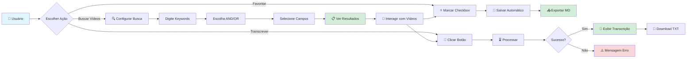
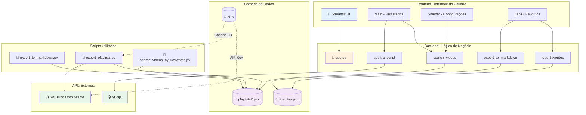

<div align="center">

# 🎥 YouTube Playlist Manager

### *Transforme suas playlists do YouTube em conhecimento organizado*

[](https://www.python.org/)
[](https://streamlit.io/)
[](LICENSE)
[]()

[Funcionalidades](#-funcionalidades) • [Instalação](#-instalação-rápida) • [Arquitetura](#-arquitetura) • [Documentação](#-documentação)

</div>

---

## 📖 Sobre o Projeto

O **YouTube Playlist Manager** é uma aplicação completa e moderna para gerenciar, buscar e transcrever vídeos de playlists do YouTube. Desenvolvido com foco em produtividade e experiência do usuário, permite que você organize seu conteúdo do YouTube de forma inteligente, com busca avançada, sistema de favoritos e transcrições automáticas.

### 🎯 Problema que Resolve

Você tem centenas ou milhares de vídeos salvos em playlists do YouTube e precisa:
- 🔍 Encontrar rapidamente vídeos específicos por palavras-chave
- 📝 Obter transcrições completas para estudo ou referência
- ⭐ Organizar seus vídeos favoritos
- 📊 Exportar informações para análise offline
- 🎨 Ter uma interface moderna e intuitiva

**Esta ferramenta resolve todos esses problemas!**

## ✨ Funcionalidades

<table>
<tr>
<td width="50%">

### 🔍 Busca Inteligente
- Operadores lógicos **AND/OR**
- Busca em título e/ou descrição
- Case-insensitive
- Destaque de keywords

### ⭐ Sistema de Favoritos
- Marcar vídeos com checkbox
- Persistência automática
- Exportação para Markdown
- Histórico de adição

</td>
<td width="50%">

### 📝 Transcrições Automáticas
- Suporte multi-idioma (PT/EN)
- Timestamps `[MM:SS]`
- Download em TXT
- Tecnologia yt-dlp robusta

### 📊 Exportação de Dados
- Playlists completas em JSON
- Resultados de busca em MD
- Favoritos em Markdown
- Metadados completos

</td>
</tr>
</table>

---

## 🎬 Fluxo de Experiência do Usuário



---

## 🏗️ Arquitetura do Sistema



### 📐 Componentes da Arquitetura

#### 1️⃣ **Frontend (Streamlit)**
- **Interface Responsiva**: Layout moderno com sidebar e tabs
- **Estado Persistente**: Uso de `st.session_state` para manter dados
- **Componentes Interativos**: Checkboxes, botões, text areas
- **Feedback Visual**: Spinners, alertas, mensagens de sucesso/erro

#### 2️⃣ **Backend (Python)**
- **Busca Inteligente**: Algoritmo de matching com operadores lógicos
- **Gerenciamento de Favoritos**: CRUD completo com persistência JSON
- **Processamento de Transcrições**: Integração robusta com yt-dlp
- **Exportação de Dados**: Formatação Markdown com templates

#### 3️⃣ **Camada de Dados**
- **Playlists JSON**: Estrutura normalizada com metadados completos
- **Favoritos JSON**: Schema com timestamp e referências
- **Variáveis de Ambiente**: Configuração segura via .env

#### 4️⃣ **Integrações Externas**
- **YouTube Data API v3**: Listagem de playlists e metadados
- **yt-dlp**: Download robusto de transcrições com fallback multi-idioma

---

## 🚀 Instalação Rápida

### Pré-requisitos

- Python 3.13 ou superior
- Conta Google Cloud com YouTube Data API v3 habilitada
- Git (opcional)

### Passo a Passo

```bash
# 1. Criar ambiente virtual
python3 -m venv venv
source venv/bin/activate

# 2. Instalar dependências
pip install -r requirements.txt
```

### Configuração

1. Crie um arquivo `.env` na raiz do projeto:

```bash
# YouTube API Key
YOUTUBE_API_KEY=sua_api_key_aqui

# YouTube Channel Info
YOUTUBE_CHANNEL_ID=seu_channel_id
YOUTUBE_CHANNEL_NAME=Seu Nome
```

### Exportar Playlists

```bash
# Exporta todas as playlists do canal para JSON
python scripts/export_playlists.py
```

### Buscar Vídeos (CLI)

```bash
# Busca vídeos por palavras-chave e exporta para Markdown
python scripts/search_videos_by_keywords.py
```

### Interface Streamlit 🎨

```bash
# Inicia a aplicação web
streamlit run app.py
```

A aplicação abrirá automaticamente no navegador em `http://localhost:8501`

## 📁 Estrutura do Projeto

```
LAB/
├── .env                    # Configurações (API Key, Channel ID)
├── .gitignore              # Arquivos ignorados pelo Git
├── app.py                  # Aplicação Streamlit principal
├── requirements.txt        # Dependências Python
├── README.md               # Documentação do projeto
├── favorites.json          # Vídeos favoritos (gerado automaticamente)
├── scripts/
│   ├── export_playlists.py           # Exporta playlists para JSON
│   ├── get_playlist_info.py          # Obtém info de uma playlist
│   ├── list_youtube_playlists.py     # Lista playlists públicas
│   ├── search_videos_by_keywords.py  # Busca por keywords (CLI)
│   ├── export_to_markdown.py         # Exporta resultados para MD
│   └── testes/                       # Scripts de teste (não versionados)
│       ├── test_transcript.py
│       ├── test_direct_transcript.py
│       ├── test_youtube_api.py
│       └── test_ytdlp.py
└── playlists/
    ├── playlist1.json
    ├── playlist2.json
    └── ...
```

## 🎨 Funcionalidades da Interface Streamlit

### Busca de Vídeos
1. **Configure os critérios** na barra lateral:
   - Digite palavras-chave (uma por linha)
   - Escolha operador: AND ou OR
   - Selecione onde buscar: título, descrição ou ambos

2. **Clique em "Buscar"** para ver os resultados

### Marcar Favoritos
- ✅ Marque o checkbox ao lado de cada vídeo
- Os favoritos são salvos automaticamente em `favorites.json`
- Acesse a aba "⭐ Favoritos" para ver todos os marcados

### Obter Transcrições
1. Clique no botão "📄 Obter Transcrição" em qualquer vídeo
2. A transcrição será exibida com timestamps
3. Baixe a transcrição em formato TXT

### Exportar Favoritos
- Na aba "⭐ Favoritos", clique em "📥 Exportar Favoritos para Markdown"
- Baixe um arquivo Markdown com todos os seus vídeos favoritos

## 🔧 Scripts Disponíveis

### 1. Export Playlists
```bash
python scripts/export_playlists.py
```
Exporta todas as playlists públicas do canal configurado no `.env`

### 2. Search Videos
```bash
python scripts/search_videos_by_keywords.py
```
Busca vídeos com critérios pré-definidos (RAG + text) OR (RAG + SQL)

### 3. Export to Markdown
```bash
python scripts/export_to_markdown.py
```
Exporta resultados de busca para arquivo Markdown formatado

### 4. Get Playlist Info
```bash
python scripts/get_playlist_info.py
```
Obtém informações detalhadas de uma playlist específica

## 📊 Exemplos de Uso

### Buscar vídeos sobre RAG
```python
# Na interface Streamlit:
# 1. Digite na barra lateral:
#    RAG
#    text
# 2. Operador: OR
# 3. Buscar em: Título e Descrição
# 4. Clique em "Buscar"
```

### Buscar vídeos sobre Python e AI
```python
# Na interface Streamlit:
# 1. Digite na barra lateral:
#    Python
#    AI
# 2. Operador: AND
# 3. Buscar em: Título e Descrição
# 4. Clique em "Buscar"
```

## 🎯 Recursos Avançados

### Transcrições Automáticas
- Suporta múltiplos idiomas (PT, EN)
- Fallback automático para idiomas disponíveis
- Formato com timestamps `[MM:SS] texto`
- Download em TXT

### Sistema de Favoritos
- Persistência automática
- Exportação para Markdown
- Remoção fácil de favoritos
- Histórico de quando foi adicionado

### Busca Inteligente
- Operadores lógicos (AND/OR)
- Busca case-insensitive
- Busca em título, descrição ou ambos
- Destaque de keywords encontradas

## 🛠️ Tecnologias Utilizadas

- **Python 3.13+**
- **Streamlit** - Interface web moderna e interativa
- **Google API Client** - API do YouTube Data v3
- **yt-dlp** - Download de transcrições (robusto e confiável)
- **Pandas** - Manipulação de dados
- **python-dotenv** - Gerenciamento de variáveis de ambiente

## 📝 Notas

- A API do YouTube tem limites de quota diários
- Transcrições só estão disponíveis para vídeos que as possuem
- Os favoritos são salvos localmente em `favorites.json`
- As playlists são exportadas para o diretório `playlists/`

---

## 📸 Screenshots

<div align="center">

### Interface Principal
*Busca avançada com operadores lógicos e visualização de resultados*

### Sistema de Favoritos
*Marque vídeos importantes e exporte para Markdown*

### Transcrições Automáticas
*Obtenha transcrições completas com timestamps*

</div>

---

## 🛠️ Stack Tecnológico

<table>
<tr>
<td align="center" width="25%">
<br/>
<b>Python 3.13+</b><br/>
Linguagem principal
</td>
<td align="center" width="25%">
<br/>
<b>Streamlit</b><br/>
Framework UI
</td>
<td align="center" width="25%">
<br/>
<b>YouTube API v3</b><br/>
Dados de playlists
</td>
<td align="center" width="25%">
<br/>
<b>yt-dlp</b><br/>
Transcrições
</td>
</tr>
</table>

---

## 📊 Estrutura de Dados

### Playlist JSON Schema
```json
{
  "playlist_id": "string",
  "playlist_name": "string",
  "playlist_url": "string",
  "channel_id": "string",
  "channel_name": "string",
  "videos": [
    {
      "video_id": "string",
      "title": "string",
      "description": "string",
      "video_url": "string",
      "thumbnail_url": "string",
      "published_at": "ISO 8601",
      "duration": "string",
      "view_count": "integer",
      "like_count": "integer"
    }
  ]
}
```

### Favorites JSON Schema
```json
{
  "video_id": {
    "video": { /* objeto completo do vídeo */ },
    "playlist": "string",
    "added_at": "ISO 8601"
  }
}
```

---

## 🔒 Segurança e Privacidade

- ✅ **API Keys**: Armazenadas localmente em `.env` (não versionado)
- ✅ **Dados Locais**: Todas as informações ficam no seu computador
- ✅ **Sem Tracking**: Nenhum dado é enviado para servidores externos
- ✅ **Open Source**: Código auditável e transparente

---

## 🤝 Contribuindo

Contribuições são bem-vindas! Sinta-se à vontade para:

1. 🐛 Reportar bugs
2. 💡 Sugerir novas funcionalidades
3. 🔧 Enviar pull requests
4. 📖 Melhorar a documentação

### Como Contribuir

```bash
# 1. Fork o projeto
# 2. Clone seu fork
git clone https://github.com/seu-usuario/youtube-playlist-manager.git

# 3. Crie uma branch para sua feature
git checkout -b feature/nova-funcionalidade

# 4. Commit suas mudanças
git commit -m "✨ Adiciona nova funcionalidade"

# 5. Push para o GitHub
git push origin feature/nova-funcionalidade

# 6. Abra um Pull Request
```

---

## 📝 Roadmap

### Versão Atual (v1.0.0)
- ✅ Interface Streamlit completa
- ✅ Busca avançada com AND/OR
- ✅ Sistema de favoritos
- ✅ Transcrições automáticas
- ✅ Exportação para Markdown

### Próximas Versões
- [ ] 🔍 Busca full-text nas transcrições
- [ ] 📊 Dashboard com estatísticas e gráficos
- [ ] 🏷️ Sistema de tags customizadas
- [ ] 📅 Filtros por data e duração
- [ ] 🌐 Suporte a múltiplos canais
- [ ] 💾 Cache de transcrições
- [ ] 📄 Exportação para PDF
- [ ] 🔔 Notificações de novos vídeos

---

## 📄 Licença

Este projeto está sob a licença MIT. Veja o arquivo [LICENSE](LICENSE) para mais detalhes.

---

## 👨‍💻 Autor

Desenvolvido com ❤️ por [Persival Balleste](https://github.com/ian-iania)

---

## 🙏 Agradecimentos

- [Streamlit](https://streamlit.io/) - Framework incrível para criar apps Python
- [yt-dlp](https://github.com/yt-dlp/yt-dlp) - Ferramenta robusta para download de vídeos
- [Google](https://developers.google.com/youtube/v3) - YouTube Data API v3
- Comunidade Python - Por todas as bibliotecas fantásticas

---

## 📞 Suporte

Encontrou um problema? Tem alguma dúvida?

- 📧 Email: [seu-email@exemplo.com]
- 🐛 Issues: [GitHub Issues](https://github.com/ian-iania/youtube-mychannel-interpreter/issues)
- 💬 Discussões: [GitHub Discussions](https://github.com/ian-iania/youtube-mychannel-interpreter/discussions)

---

<div align="center">

### ⭐ Se este projeto foi útil, considere dar uma estrela!

**[⬆ Voltar ao topo](#-youtube-playlist-manager)**

---

*Feito com Python 🐍 e muito ☕*

</div>
